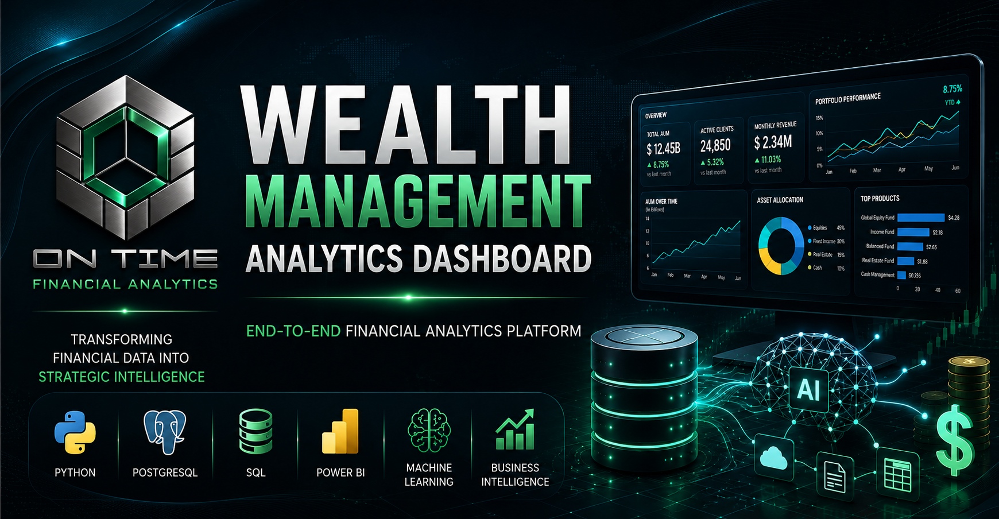

<p align="center">
  
</p>

# Wealth Management Analytics Dashboard

> End-to-End Financial Analytics Platform for Wealth Management and Business Intelligence.

---


---

# About the Project

The **Wealth Management Analytics Dashboard** is an end-to-end data analytics platform developed to simulate the analytical environment of an investment advisory firm.

This project demonstrates the complete lifecycle of a modern analytics solution, including:

- Data Modeling
- Data Engineering
- ETL Pipelines
- PostgreSQL Database
- Business Intelligence
- KPI Design
- Financial Analytics
- Machine Learning
- API Development
- Documentation

Instead of focusing only on dashboards, this repository reproduces how analytics products are designed inside financial institutions.

---

# Business Problem

Investment advisors manage thousands of clients and millions of dollars in assets.

Decision makers need to answer questions like:

- Which advisors generate the highest revenue?
- Which clients are at risk of leaving?
- What is the profitability of each investment product?
- How does client allocation change over time?
- Which regions concentrate the highest AUM?

This project centralizes all these indicators into one analytical platform.

---

# Solution Architecture

```

Raw Data
↓

Bronze Layer
↓

Silver Layer
↓

Gold Layer
↓

PostgreSQL
↓

Python Analytics
↓

Power BI Dashboard
↓

Business Decision

```

---

# Main Features

✔ Customer Portfolio Analytics

✔ Assets Under Management (AUM)

✔ Revenue Analysis

✔ Advisor Performance

✔ Product Performance

✔ Client Segmentation

✔ Churn Indicators

✔ Financial KPIs

✔ ETL Pipeline

✔ SQL Views

✔ Stored Procedures

✔ REST API

✔ Machine Learning Ready

---

# Technologies

| Technology   | Purpose             |
| ------------ | ------------------- |
| Python       | Data Processing     |
| PostgreSQL   | Database            |
| SQL          | Data Modeling       |
| Power BI     | Visualization       |
| Pandas       | Data Analysis       |
| NumPy        | Numerical Computing |
| Scikit-Learn | Machine Learning    |
| FastAPI      | API                 |
| Git          | Version Control     |

---

# Project Structure

```

wealth-management-analytics-dashboard/

docs/
database/
python/
data/
powerbi/
tests/
images/

```

---

# Key KPIs

The platform tracks more than 30 business indicators, including:

- Assets Under Management
- Net New Assets
- Client Retention Rate
- Revenue per Advisor
- Revenue per Client
- Portfolio Return
- Product Distribution
- Client Lifetime Value
- Churn Probability
- Advisor Ranking
- Monthly Growth

---

# Roadmap

- [x] Project Planning
- [x] Documentation
- [ ] PostgreSQL Database
- [ ] ETL Pipeline
- [ ] Synthetic Data Generator
- [ ] Power BI Dashboard
- [ ] Machine Learning
- [ ] REST API
- [ ] Docker Deployment

---

# Screenshots

Coming soon...

---

# Future Improvements

- Azure Deployment

- Docker

- CI/CD

- Data Warehouse

- Recommendation Engine

- Predictive Analytics

- Real-time Dashboards

---

# Author

## Renato Novaes

Data Scientist

Financial Analytics

Business Intelligence

Investment Specialist (CEA)

MBA in Data Science & Artificial Intelligence (USP)

Professor of Technical Education

---

## Connect with me

LinkedIn

GitHub

Email

---

If you found this project interesting, consider giving it a ⭐.
