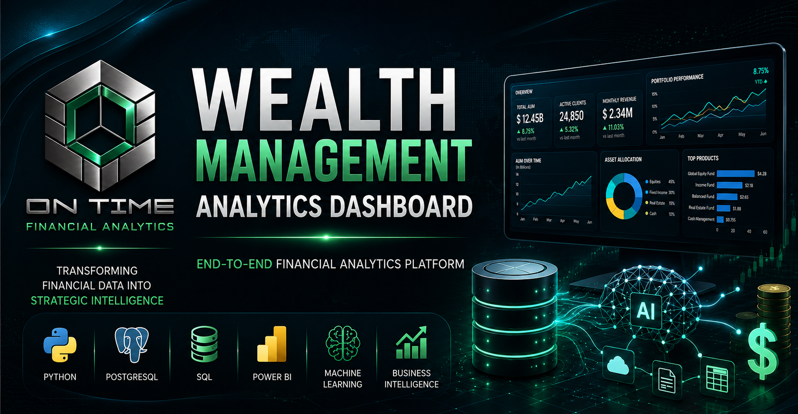

<p align="center">
  
</p>

# Wealth Management Analytics Dashboard

> End-to-End Financial Analytics Platform for Wealth Management and Business Intelligence.

---


---

# About the Project

The **Wealth Management Analytics Dashboard** is an end-to-end data analytics platform developed to simulate the analytical environment of an investment advisory firm.

This project demonstrates the complete lifecycle of a modern analytics solution, including:

- Data Modeling
- Data Engineering
- ETL Pipelines
- PostgreSQL Database
- Business Intelligence
- KPI Design
- Financial Analytics
- Machine Learning
- API Development
- Documentation

Instead of focusing only on dashboards, this repository reproduces how analytics products are designed inside financial institutions.

---

# Business Problem

Investment advisors manage thousands of clients and millions of dollars in assets.

Decision makers need to answer questions like:

- Which advisors generate the highest revenue?
- Which clients are at risk of leaving?
- What is the profitability of each investment product?
- How does client allocation change over time?
- Which regions concentrate the highest AUM?

This project centralizes all these indicators into one analytical platform.

# Business Rules

The synthetic data generation follows realistic wealth management business rules.

Implemented rules include:

- 5,870 investment clients
- 19 Financial Advisors
- Three advisor hierarchy levels
  - Level 1
  - Level 2
  - Private
- Advisor certifications
- Client wealth segmentation
- Investor suitability
- Product suitability by investor profile
- Randomized financial transactions
- Six years of historical data (2020–2025)
- Referential integrity across all dimensions

---

# Solution Architecture

```text
Raw Data
    ↓
Bronze Layer
    ↓
Silver Layer
    ↓
Gold Layer
    ↓
PostgreSQL Data Warehouse
    ↓
Python Analytics
    ↓
Power BI Dashboard
    ↓
Business Decision
```

---

# Current Progress

## Completed

- Project Planning
- Business Documentation
- Star Schema Data Warehouse
- PostgreSQL Database
- Database Schemas
- Dimension Tables
- Fact Tables
- Synthetic Data Generator
- Calendar Dimension
- Client Dimension
- Product Dimension
- Advisor Dimension
- Client–Advisor Relationship
- Financial Transactions Fact Table
- Business Rules Implementation
- Referential Integrity Validation

## In Progress

- Power BI Semantic Model
- Executive Dashboard

---

# Database Structure

wealth_management_dw
│
├── audit
├── dw
│ ├── dim_calendar
│ ├── dim_client
│ ├── dim_product
│ ├── dim_advisor
│ └── fact_transactions
│
├── etl
├── mart
├── public
└── staging

---

# Database Scripts

database/
├── ddl
│ ├── 02_create_schemas.sql
│ ├── 03_create_dimensions.sql
│ ├── 04_create_fact_tables.sql
│ ├── 05_create_dim_advisor.sql
│ └── 06_alter_dim_client.sql
│
└── dml
├── 06_insert_dim_calendar.sql
├── 07_insert_dim_client.sql
├── 08_insert_dim_product.sql
├── 09_insert_dim_advisor.sql
└── 10_insert_fact_transactions.sql

---

# Main Features

✔ Star Schema Data Warehouse

✔ Synthetic Financial Dataset

✔ Wealth Management Simulation

✔ Advisor Performance Analytics

✔ Assets Under Management (AUM)

✔ Client Segmentation

✔ Product Allocation

✔ Portfolio Analytics

✔ Financial KPIs

✔ Investor Suitability

✔ Business Rules Engine

✔ SQL Analytics

✔ Power BI Ready

✔ Machine Learning Ready

# Synthetic Dataset

The project currently contains:

| Dataset      |  Records |
| ------------ | -------: |
| Calendar     |    2,192 |
| Clients      |    5,870 |
| Advisors     |       19 |
| Products     |       15 |
| Transactions | ~640,000 |

## The dataset was generated using realistic business rules inspired by private banking and wealth management environments.

# Business Scenario

The project simulates the analytical environment of a Brazilian investment advisory firm.

Business structure:

- 5,870 investors
- 19 Financial Advisors
- Three advisor hierarchy levels
- Fifteen investment products
- Six years of historical transactions
- More than 640 thousand financial operations

Each advisor manages clients according to predefined wealth ranges and certification levels, reproducing a realistic private banking operation.

# Technologies

wealth-management-analytics-dashboard/
│
├── architecture/
├── data/
├── database/
│ ├── backups/
│ ├── ddl/
│ ├── dml/
│ ├── functions/
│ ├── indexes/
│ ├── procedures/
│ ├── queries/
│ ├── views/
│
├── docs/
├── images/
├── notebooks/
├── powerbi/
├── python/
└── .vscode/

---

# Key KPIs

The platform tracks more than 30 business indicators, including:

- Assets Under Management
- Net New Assets
- Client Retention Rate
- Revenue per Advisor
- Revenue per Client
- Portfolio Return
- Product Distribution
- Client Lifetime Value
- Churn Probability
- Advisor Ranking
- Monthly Growth

---

# Roadmap

# Roadmap

- [x] Project Planning
- [x] Documentation
- [x] PostgreSQL Database
- [x] Data Warehouse Modeling
- [x] Synthetic Data Generator
- [x] Business Rules
- [x] Advisor Assignment
- [ ] Power BI Data Model
- [ ] Executive Dashboard
- [ ] Advisor Dashboard
- [ ] Client Dashboard
- [ ] Product Dashboard
- [ ] Machine Learning
- [ ] REST API
- [ ] Docker Deployment

---

# Screenshots

Coming soon...

---

# Future Improvements

- Azure Deployment
- Docker
- CI/CD
- Data Warehouse
- Recommendation Engine
- Predictive Analytics
- Real-time Dashboards

---

# Author

## Renato Novaes

**Data Scientist**

Financial Analytics

Business Intelligence

Investment Specialist (CPA e C Pro-I)

MBA in Data Science & Artificial Intelligence (USP)

Professor of Technical Education

---

## Connect with me

- [LinkedIn](https://www.linkedin.com/in/renato-novaes-financial-data-analyst/)
- [GitHub](https://github.com/Renatoinvest)
- Email: renatovenancionovaes26@gmail.com

---

If you found this project interesting, consider giving it a ⭐.
